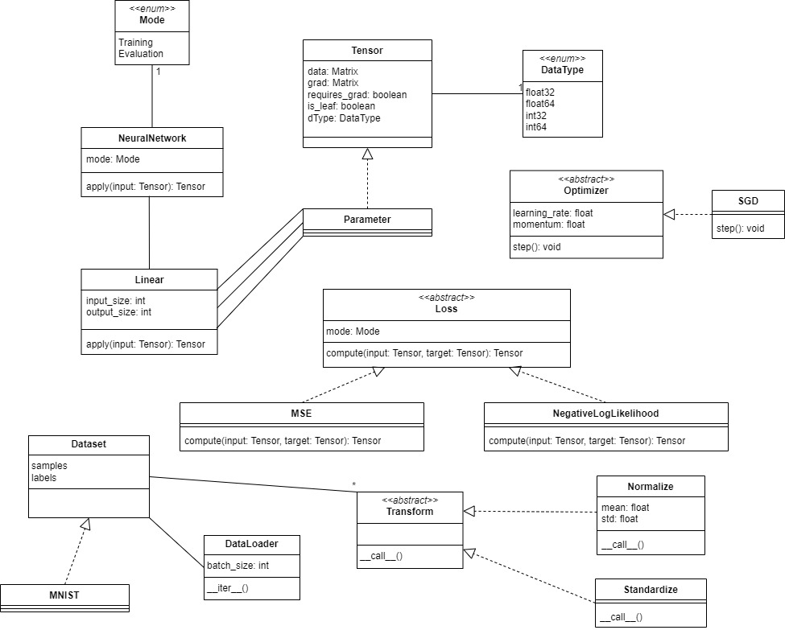
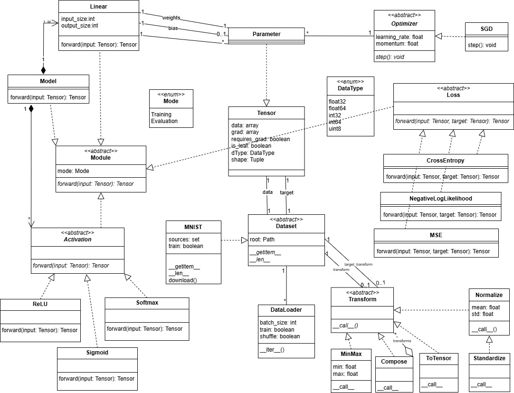
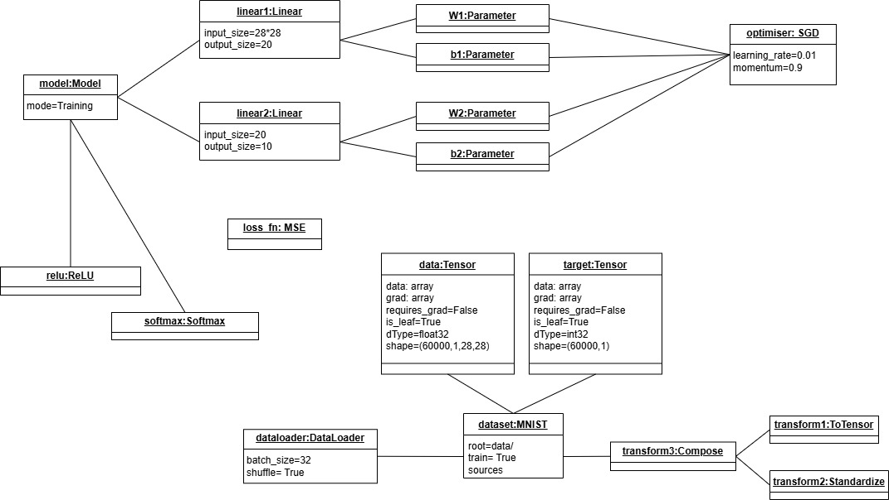

# Section 1:

## Class and Object Diagrams

### Version 0:



This initial version of the class diagram was constructed according to the description given for each entity, similar to the UML we have seen in class. It was later refined following the user interface that we must use and the implementation of the code. 

### Final Version:

#### Class Diagram:



- class `Module` defined as abstract class will serve as a base class for `Model`, `Linear`, `Activation`, and - `Loss` to enforce them to implement the abstract forward method, so these classes have inheritance relationships with `Module`.  
- class `Model` has a composition relationship with `Linear' since we assumed that if we deleted a model its linear layers should not exist on their own. It is 1 to 1..M relationship: 1 model should have at least 1 linear layer, and a defined linear layer should belong to only one model.
- class `Model` has a composition relationship with `Activation`. It is 1 to many relationship. A model can have 0 or many activation functions, and a defined activation function can belong to one model.
- class 'Linear' has 1 to many relationship with `Parameter`. There is two associations: one for the weights and one for the bias. For the weights it is 1 to 1, and for the bias it is 1 to 0..1 since the bias is optional. 
- class `Parameter` inherits `Tensor`. 
- class `Optimizer` updates the parameters of the model. So it has 1 to many relationship with `Parameter`. 
- class `Activation` is defined as an abstract class to enforce the activation functions `Sigmoid`, `ReLU`, and `Softmax`, childs of `Activation`, to implement the forward method.
- class `Loss` is defined as an abstract class to enforce the loss functions `MSE`, `CrossEntropy`, and `NegativeLogLikelihood`, childs of `Loss`, to implement the forward method. 
- class `Dataset` is defined as an abstract class to enforce the childs like 'MNIST' to implement the abstract method `__getitem__` and `__len__`. It has two associations with `Tensor`: one for the data and one for the target, 1 to 1 relationship. It has one to many relationship with `DataLoader` since a dataset can be loaded by 0 or many dataloaders, and a dataloader can load 1 dataset. It has also two associations with `Transform`: one for transformation of the data and one for the target, 1 to 0..1 relationship assuming that we create a new transform each time we want to transform the data or the target of a given dataset and we can have a dataset without any transformation or 1 transformation that can be `Compose` if we want to apply multiple transformations.
- class `ToTensor`, `MinMax`, `Normalize` are the transformations that can be applied to the data and target. They inherit from `Transform`. `Standardize` is a child of `Normalize`.
- class `Compose` is a transformation that can apply multiple transformations to the data and target. It has a 1 to many relationship with `Transform` since it can apply 0 or many transformations. It inherits from Transform and it has an aggregation relationship with `Transform` since it contains a list of transformations. 

#### Object Diagram:



To provide an object diagram, we took a specific example. Note that the abstract classes we defined cannot be instantiated as objects. So the object diagram contains only the entities that can be instantiated as objects with their attributes. 
We considered a model with mode=Training and a dataset of type MNIST with train=True that have data and target as Tensor type. A dataloader with batch_size=32 and shuffle=True is used to load the dataset, and transform3 of type Compose is applied to the dataset and this transform3 is composed of two other transforms, transform1 of type ToTensor and transform2 of type Standardize. The model has two linear layers, one ReLU activation function to be applied after the first linear layer and a second activation function: Softmax to be applied to the output layer. linear1 has W1 and b1 as parameters, and linear 2 has W2 and b2 as parameters. All the parameters will be accessed by the optimiser of type SGD with learning_rate=0.01 and momentum=0.9 to update them. A loss_fn of type MSE is used. Only direct relationships are shown in the object diagram similar to the class diagram, but the model will have access to the data by using the dataloader and the loss function will be applied to the output of the model and the target of the dataset. 

## Computation Graph Implementation

In our library, the computation graph is implicitly constructed by storing the parents of the outputs of all operations along with name of the operation that led to them and its corresponding derivation formula. 

### Forward Pass & Graph Construction

#### Initial Version

With the execution of forward through `y_hat = model(x)`, multiple linear steps are executed:
```python 
x = self.linear1(x)
x = self.relu(x)
x = self.linear2(x)
x = self.softmax(x)
```
Each step involves one or more basic operations. For instance, `self.linear1(x)` consists of the \__matmul__ `x@weights` and the \__add__ `(x@weights)+bias`. For each operation, the parents, operation name, and corresponding grad function will be stored in the output. Thus, by the end of the forward propagation, we can trace `y_hat` as the softmax output of its predecessor, which is the output of the addition of the biases of linear2 and (x@weights2), and so on to the beginning. This gives rise to a conceptual computation graph representation storing all primitive steps of the forward propagation, as well as the gradient functions needed for the backward propagation later on. 

To achieve this, all primitive operations were redifined in Tensor. An example is provided below:

```python
def __matmul__(self, other): 
        other = other if isinstance(other, Tensor) else Tensor(other)
        out = Tensor(self.data @ other.data, requires_grad=self.requires_grad or other.requires_grad)
        out.parents = {self, other}
        def _backward(grad):
            if self.requires_grad:
                if self.grad is None:
                    self.grad = grad @ other.data.T
                else:
                    self.grad += grad @ other.data.T
            if other.requires_grad:
                if other.grad is None:
                    other.grad = self.data.T @ grad
                else:
                    other.grad += self.data.T @ grad
        out.grad_fn = _backward
        out.grad_fn_name = "MatMulBackward"
        return out
```
Within each primitive operation, the operands are added to a set called parents. It must be a set since the same operand could occur more than once but it must be counted only once. Similarly, the operation name is stored in grad_fn_name. A _backward function is defined within each primitive operation to compute its gradient. The function is stored in grad_fn to be only executed when needed. 

Moreover, in the initial version (as in branches `prototype` and `prototype2`), the activation functions were also defined in the same format within Tensor to simplify testing. The forward method of the loss functions that inherit class `Loss` were also defined in the same format to contribute to the computation graph construction. For instance, MSE was defined as follows:

```python
class MSE(Loss):
    def forward(self, y, y_hat):
        batch_size = y_hat.data.shape[0]
        error = y_hat.data - y.data
        loss = np.mean(error ** 2)
        out = Tensor(loss, requires_grad=True)
        
        out.parents = {y, y_hat}

        def _backward(grad):
            grad_input = 2 * (y_hat.data - y.data) / batch_size
            if y_hat.grad is None:
                y_hat.grad = grad_input
            else:
                y_hat.grad += grad_input

        out.grad_fn = _backward
        out.grad_fn_name = "MSEBackward"
        
        return out
```

#### Refined Version

This initial version was optimized by seperating the activation functions from Tensor and simplifying the code for all operations through the use of a backward decorator. To this end, a seperate function `grad_compute` was defined to compute the gradients of all operations, as in the snippet below:

```python
def grad_compute(self, grad, op_type, other=None):
        def update_grad(grad, target_tensor, factor=1):
            """Helper function to update the gradient of a tensor."""
            if target_tensor.requires_grad:
                target_tensor.grad = grad * factor if target_tensor.grad is None else target_tensor.grad + grad * factor

        if op_type == "add":
            update_grad(grad, self)
            update_grad(grad, other, factor=1)

        elif op_type == "neg":
            update_grad(-grad, self)

        elif op_type == "mul":
            update_grad(grad * other.data, self)
            update_grad(grad * self.data, other)
```

Furthermore, a `backward_decorator` was defined to take care of the operation name, parents, and gradient function storage as well as the execution (during the forward pass) of all operation types:

```python
def backward_decorator(op_type):
        def decorator(func):
            def wrapper(self, other):
                result = func(self, other)
                other = other if isinstance(other, Tensor) else Tensor(other)
                result.parents = {self, other}
                # Attach the grad function to the result tensor
                result.grad_fn = lambda grad: self.grad_compute(grad, op_type, other)
                result.grad_fn_name = f"{op_type}Backward"
                return result
            return wrapper
        return decorator
```

This allows for the simplification of the definition of all operations to the following format:
```python
 @backward_decorator("matmul")
    def __matmul__(self, other):
        other = other if isinstance(other, Tensor) else Tensor(other)
        return Tensor(self.__data @ other.__data, requires_grad=self.__requires_grad or other.__requires_grad, is_leaf=False)
```
The decorator takes the forward operation name as a parameter, both to store it in `grad_fn_name` and to assign the proper `grad_fn` using the gradient engine `grad_compute`.

A similar organization was applied to both `Activation` and `Loss`, the main difference being defining the `backward_decorator` as a static method in them to be able to use it in all classes inheriting them. An example of these functions within the class Loss is highlighted below:

```python
    def grad_compute(self, loss_type, y, y_hat):
        """
        #Centralized gradient computation for different loss functions.
        """
        if loss_type == "MSE":
            # Gradient of MSE loss with respect to y_hat
            batch_size = y_hat.data.shape[0]
            grad_input = 2 * (y_hat.data - y.data) / batch_size

        elif loss_type == "CrossEntropyLoss":
            # One-hot encoding of y
            one_hot_y = np.zeros((y.data.size, y_hat.data.shape[0]))
            one_hot_y[np.arange(y.data.size), y.data] = 1
            one_hot_y = one_hot_y.T
            
            grad_input = - (one_hot_y / y_hat.data) / y.data.size
            y_hat.grad = grad_input if y_hat.grad is None else y_hat.grad + grad_input

        return  y_hat.grad       
```

```python
    @staticmethod
    def backward_decorator(loss_type):
        def decorator(func):
            def wrapper(self, y, y_hat):
                out = func(self, y, y_hat)
                out.grad_fn = lambda grad: self.grad_compute(loss_type, y, y_hat)
                out.grad_fn_name = f"{loss_type}Backward"
                out.parents = {y, y_hat}
                return out
            return wrapper
        return decorator
```
Then MSE is simplified to:
```python
class MSE(Loss):
    @Loss.backward_decorator("MSE")
    def forward(self, y, y_hat):
        error = y_hat.data - y.data
        loss = np.mean(error ** 2)
        return Tensor(loss, requires_grad=True, is_leaf=False)
```

### Backward Pass

The main backward function is defined in `Tensor` to be executed through:
```python
loss = loss_fn(y, y_hat) # loss is the Tensor output of the loss function
loss.backward()
```

It starts by setting the gradient of this first tensor `loss` to 1.
```python
    def backward(self):
        # Start the backward pass if this tensor requires gradients
        if not self.__requires_grad:
            raise ValueError("This tensor does not require gradients.")  
        # Initialize the gradient for the tensor if not already set
        if self.grad is None:
            self.grad = np.ones_like(self.__data)  # Start with gradient of 1 for scalar output
```

#### Topological Ordering

Next, a stack data structure is used to ensure following a topological ordering during the backward propagation: 
```python     
        to_process = [self]
        # Processing the tensors in reverse order through a stack data structure (to establish topological order)
        while to_process:
            tensor = to_process.pop()
            # If this tensor has a backward function, then call it
            if tensor.grad_fn is not None:
                tensor.grad_fn(tensor.grad) # Pass the gradient to the parent tensors
                # Add the parents of this tensor to the stack for backpropagation
                to_process.extend([parent for parent in tensor.parents if parent.requires_grad])
```
The tensor `loss` is the first to be added to `to_process`. Next, its `grad_fn` is executed and its parents `y and y_hat` are added to the stack. The same process keeps repeating until the stack is empty. The `grad_fn` of `loss` was defined through the static `backward_decorator` during the forward propagation, but only executed when `backward()` is called.  

Following this approach, the chain rule will be applied to compute the gradient of the loss w.r.t the weights and biases by traversing the computation graph step-by-step in reverse order. Each node will execute its previously stored `grad_fn` and add its `parents` to the stack.

A condition is added to correct the biases gradient since the biases are broadcasted in the linear layers computations to match the batch size used. In this condition, `is_leaf` is used to only check for leaf tensors that have no parents (i.e. only weights, biases, and input data). `is_leaf` is set as True by default, but it is set as False for the tensor outputs of all operations.  

```python
          #check if the tensor is a leaf and it was broadcasted (in case of batch_size>1)
          if tensor.is_leaf and tensor.data.shape != tensor.grad.shape:
                tensor.grad = np.sum(tensor.grad,axis=1).reshape(-1,1) #adjust the shape to match the data shape
``` 

# Section 2:

## Implementation Explanation:

### User Interface:

```python
 class Model(Module):
    def __init__(self)-> None:
        self.linear1 = Linear(32*32, 20)
        self.linear2 = Linear(20, 10)

    def forward(self, x):
        x = self.linear1(x)
        return self.linear2(x)

 model = Model()
 print(model)

 optimiser = SGD(model.parameters() , lr=0.01, momentum=0.9)
 loss_fn = MSE()
 dataset = MNIST()
 dataloader = DataLoader(dataset, batchsize=32, transform=None)

 for x, y in dataloader:
    optimizer.zero_grad()
    y_hat = model(x)
    loss = loss_fn(y, y_hat)
    loss.backward()
    optimizer.step()
```

To have this user interface, we implemented:

### _Enum_ `class DataType`

This is an _Enum_ class, belonging to module `tensor.py`. It is used to define the data types of the tensor while allowing to restrict the possible values to a set of predefined ones. In addition it performs easy conversion of the data types to numpy data types.  

It has 5 values for now:  

* `int64`
* `float64`
* `int32`
* `float32`
* `uint8`

> uint8 is used for images, and is basically a byte. It is used to represent pixel values in images, great memory saver. Also by default in the first step of processign images the pixels are converted to uint8.

Each $DataType$ object has a string representation and can be accessed by it through:  

```python
>>> DataType.__members__['int64']
int64  
>>> type(DataType.__members__['int64'])
<enum 'DataType'>
```

_In later stages of the library we can provide a function that enlists the possible values of the DataType enum for the user to see, however the user is not meant to interact with the DataType object directly, but through the `Tensor` class, so this is why we didn't prioritize it. One can argue that user want to see what dtypes are available but for now, they'll receive the list when an error is thrown if they assign an unavailable dtype through creating a Tensor object._


Dunder methods:  

| Dunder Method | Description |
|---------------|-------------|
| `__repr__`    | Returns the string representation of the dtype object. |
| `__str__`     | Returns the string representation of the dtype object. |
| `__call__`    | Makes the object callable, this way can perform casting by just calling `float32()` for instance. |
  

Aliasing was done in the Tensor module to make it a more torch-y way of accessing the dtype object:  

```python
int64 = dtype.int64
float64 = dtype.float64
```

This way, these variables will be loaded whenever the Tensor module is imported (which should be the case in all modules of the library). And then, when accessed through our library, it can be accessed this way (exactly like torch):  

```python
>>> import our_torch_wannabe_lib as torch
>>> a=torch.int64
>>> a(1.7)
1
```

### `class Module`, `Linear`, `Parameter`, `Activation`:
Since the parameters corresponding to a layer should be registered as soon as the layer is declared, and the optimizer should be able to access them through `model.parameters()`, this was handled by the `Module` class because the `Model` class is a subclass of `Module`. Also, the `Linear` class should inherit from `Module` to save its parameters in the `Module` class.

So the `Module` class has as attributes two dictionaries, one to save the subclasses and another to save the parameters.

The `Linear` class takes as inputs the `input_size` and `output_size`. In the constructor, the weights and bias are initialized as `Parameter` type (Which is a `Tensor` with `requires_grad=True` and `is_leaf=True`). Weights are randomly initialized to random values - 0.5 to be centered around 0, and the bias is initialized to 0.

The `__setattr__` method was modified inside the `Module` class as follows:
```python
def __setattr__(self, name, value): 
    if isinstance(value, Module):
        self._subclasses[name]=value
    if isinstance(value, Parameter): 
        self._parameters[name]=value
    super().__setattr__(name, value)
```
This way, when a linear layer is declared, ex: `Linear(32*32, 20)`, setting the attributes weights and bias which are of type `Parameter` will register them in the dictionary `_parameters` of the `Module` class.

When the model is declared, the different linear layers set as attributes, ex: `self.linear1 = Linear(32*32, 20)` are registered in the `_subclasses` dictionary of the `Module` class.

`super().__setattr__(name, value)` is used to normally set the attributes in the class dictionary, so that when we call `model.linear1` for example, it returns the linear layer using the default `__getattribute__` method.

Also, the `Activation` class was implemented to inherit from `Module` to save it in the `_subclasses` dictionary of the `Module` class, so that when we print the model to visualize its architecture, we can see the different layers and activation functions used in the model, and so the `__repr__` method was implemented in the `Module` class to print the model architecture:
```python
def __repr__(self):
    return f"{self.__class__.__name__}({_subclasses})"
```
with `__repr__` implemented also in the subclasses to have a representation of the layers and activation functions used in the model.

In the `Module` class, the method `__call__` was implemented to call the `forward` method presented as an abstract method in `Module`, and implemented by the subclasses (`Model`, `Linear`, `Activation`). In this way when we use: `model(x)`, the `forward` method of the model is called, which in its turn calls the `forward` method of the linear layers (when `self.linear1(x)` is called for example) and activation functions used in the model.

The `forward` method of `Linear` applies the affine linear transformation to the input `x` and outputs `y = xW^T + b`, where `W` is the weights and `b` is the bias. The `forward` method of `Activation` is an abstract method that is implemented by the different activation functions (`ReLU`, `Softmax`) that inherit `Activation` class.

### `class Dataset`, `DataLoader`, `Transform` _(extensions)_:

#### Dataset

In the `dataset.py` module, we have the `Dataset` class which is an abstract class that is meant to be inherited by other classes that implement specific datasets, custom datasets or by the user to implement their own dataset.  
This module uses helper functions to load and preprocess example datasets like MNIST. Some example functions are used to transform images to numpy arrays or tensors, visualize them, download and extract files from urls and read idx files.  

a `Dataset` object shall have the following attributes:  

* `root`: the root directory where the dataset is stored   
* `data`: the data of the dataset, in the form of a tensor  
* `targets`: the labels of the dataset, in the form of a tensor    
* `transform`: a callable (we will implement this later) that can be passed to the dataset to transform the data    
* `target_transform`: a callable (we will implement this later) that can be passed to the dataset to transform the labels  

We have the following children for now:  

```text
Dataset
├── MNIST
└── TensorDataset
```

Abstract methods to force the children to implement:  

* `__getitem__`: to get an item from the dataset, which is a tuple of the data and the label (Tensor, int)   
* `__len__`: to get the length of the dataset (number of data points)    

The `datasets` class is actually found within `torchvision` library and is used to load and preprocess datasets. What we aim to do is to provide a similar interface to the user, so that they can use our library in a similar way to how they would use PyTorch.  

##### MNIST

$MNIST$ is a class that inherits from $Dataset$ and is used to load the MNIST dataset: digits from 0 to 9 images of size 28x28, a famous dataset used for image classification.  

To start with, we will implement `MNIST` while also exploring how _`torchvision`_ does it.   
When loading it, we will get a message that the dataset is being downloaded, and then it will be stored in a folder (root), and the following file hierarchy can be seen from where we start the code:  

```text
. # -- the wd of this notebook --
└── data/
    └── MNIST/
        └── raw/
            ├── t10k-images-idx3-ubyte  
            ├── t10k-labels-idx1-ubyte
            ├── train-images-idx3-ubyte
            ├── train-labels-idx1-ubyte
            ├── t10k-images-idx3-ubyte.gz
            ├── t10k-labels-idx1-ubyte.gz
            ├── train-images-idx3-ubyte.gz
            └── train-labels-idx1-ubyte.gz
```

As we are implementing this library from scratch, might as well implement the dataset loading from scratch as well :D  

> p.s. The official site is [~https://yann.lecun.com/exdb/mnist/](https://yann.lecun.com/exdb/mnist/), however the files are not available, so we revert back to a working mirror at: [https://ossci-datasets.s3.amazonaws.com/mnist/](https://ossci-datasets.s3.amazonaws.com/mnist/), where there are essentially 2 compressed files. We will download them, extract them and read them. The data will be decompressed into idx files, which are binary files that contain the images and labels => we will transform them into `Tensor` objects (of dtype `uint8`, performing exactly like pytorch).

An interesting thing to note, while comparing out library with pytorch, is that torch uses the library `PIL` to load images and proceed transdormation of `PIL.Image.Image` objects. In our case, we used `opencv` which is based on C++ and showed better performance in terms of speed of loading.  

While respecting encapsulation✅, we implemented getters and setters for all attributes `MNIST` class.

Magic methods:

| Magic Method | Description |
|--------------|-------------|
| `__init__`   | Initializes the MNIST dataset while inheriting the `super()` constructor, takes extra attributes `download` and `train`. |
| `__getitem__`| Returns a tuple of the image and the label, after applying the transformations. Takes into consideration slicing for the training and testing sets possibly. |
| `__len__`    | Returns the length of the dataset. |
| `__iter__`   | Returns an iterator over the dataset, separated from `__getitem__` to allow for more flexibility in the future, allowing visualization of each image in the dataset for instance when needing to access each image separately. |
| `__repr__`   | Returns a string representation of the dataset, showing the number of samples and the shape of the images (super()). |

Very important note considering the `__getitem__` method:  
AS is behaved by pytorch, for the training dataset where there exist `60000` training images of dimensions `28x28`, data will be a tensor of shape `(60000, 28, 28)`, however, while accessing each point, it should be of shape `(1, 28, 28)` as in pytorch, which doesnt match the default behavior. This is why we require to expand dimensions in order to match with torch's UI.


##### TensorDataset

This class is used to create a dataset from tensors. It is used to create a dataset object that can be used for training or testing (each instance is either training or testing dataset).  

It takes:  

* `X`: tensor (data)   
* `y`: tensor (target)   
* `transform`: callable (optional)   
* `target_transform`: callable (optional)   

_and root here is not needed, as the data is already provided in the form of variables_

We will use this in an exmaple showing synthetic data generation and training a model on it.

Also respecting encapsulation✅, we implemented getters and setters for all attributes `TensorDataset` class, performin transformation on the data and target if the transform and target_transform are provided.  

The same magic method sare implemented as well, however, the `__getitem__` method is a bit different, as we are not loading images from files, but rather accessing them from the tensors directly.

#### DataLoader

$DataLoader$ is a class that is used to create an object that is iterable and can be used in the training loop. It is used to split the dataset into batches and is iterable to be usedwhile training. This can be found in the `[dataloader.py](https://github.com/deeplearning-oop/2425-m1geniomhe-group-1/src/dataloader.py)` module.  

Testing torch's `torch.utils.data.DataLoader` class, we found that it is iterable, not indexable, and has no string representation. It takes every batch of data in a tensor form: if we have 60000 `(1,28,28)` tensors and we take batch size of `64`, it'll return a loader with 938 tensors where each is of dimensions `(64,1,28,28)`(last one will be `(32,1,28,28)` if we have 60000 samples). Thus compresses every 64 (batch_size) tensors into one tensor.

Attributes:  

* `dataset`: dataset.Dataset object (child of it since it's an abstract class)   
* `batch_size`: int, default=64    
* `shuffle`: bool, default=True   
* `num_samples`: int, number of samples in the dataset (derived from the dataset object (`len()`))  

Encapsulation is respected by implementing getters and setters for all attributes (that are private) ✅

We also make validation for input paramters in `__setattr__` method, to make sure that the batch size is an integer and greater than 0, and that the shuffle is a boolean... Mainly focusing on each attribute type

| Magic Method | Description |  
|--------------|-------------|
| `__init__`   | Initializes the DataLoader object, takes the dataset, batch size and shuffle as input |  
| `__iter__`   | Makes the object iterable, returns the next batch of data, each is a tuple consisting of batch_size datapoints tensors |  
| `__len__`    | Returns the length of the DataLoader object, which is the number of batches |  
| `__getitem__`| Not indexable, raises TypeError (like torch🔥) |  

#### Transform 


The $Transform$ class is an abstract class that is meant to be inherited by other classes that implement specific transformations, in [transforms.py](https://github.com/deeplearning-oop/2425-m1geniomhe-group-1/src/transforms.py) module.  

They are all callable classes, and they all implement the `__call__` magic method, thus is the abstract method in the parent class. Their use is in the data preprocessing step before feeding the data to the model, particularly while loading the dataset using a `Dataset` object, that has 2 attributes `transform` and `target_transform` requiring an _optional_ callable object to be passed to the dataset to transform the data and the labels respectively. 

In torch it is also part of the seperate `torchvision` library in `torchvision.transforms` module. As is the case using _vision_, the most useful transformations to consider are:  

* ToTensor   
* Normalize   
* Compose

We will implement them + 2 more:  

```text
Transform
├── Compose
├── Normalize
├── ToTensor
├── Standardize
└── MinMaxNormalize
```


| Transformation | Description |  
|----------------|-------------|  
| `Compose`      | Chain several transformations together, given a list of transformations -> _transformation of transformations_ |  
| `ToTensor`     | Converts the input data to a tensor, this can be a combination of different transformations (image, tensor or numpy array -> tensor) |  
| `Normalize`    | Normalize the input data (tensor), given a tensor, mean and standard deviation |  
| `Standardize`  | Standardize the input data (tensor), given a tensor to have a mean of 0 and std dev of 1 |  
| `MinMaxNormalize` | Normalize the input data (tensor) to the range [min, max], given their values to scale |  

##### Compose

$Compose$ is a series of transformations that are applied to the data in a sequential manner. It is used to chain several transformations together, as in $c(x)=f(g(x))$.  

It takes a list of transformations as input, and applies them in the order they are passed.  

The `__call__` method is implemented to apply the transformations in the order they are passed.  

##### Normalize  

$Normalize$ is a class that inherits from $Transform$ and is used to normalize the input data. It is used to normalize the input data, given a tensor, mean and standard deviation.  

It takes the mean and standard deviation as input, and applies the normalization to the input data, INPLACE (because will ease out the data processign step and saves a lot of memory).  

The `__call__` method is implemented to apply the normalization to the input data.  

##### Standardize

This is actually a child of Normalize, where the mean is the mean of tensor and the std is the std of the tensor given. Thus it has no attributes, and the mean and std are calculated on the fly, using the fast numpy operations.  

It's intended to transform the input data to have a mean of 0 and a standard deviation of 1, a very useful transformation in machine learning.  

##### MinMaxNormalize

$MinMaxNormalize$ is a class that inherits from $Transform$ and is used to normalize the input data to the range [min, max]. It is used to normalize the input data, given a tensor, min and max values.

It takes the min and max values as input, and applies the normalization to the input data.

The `__call__` method is implemented to apply the normalization to the input data.

> In all the cases where there exist attributes (inplace, mean, std, min, max), we implemented getters and setters for them, respecting encapsulation✅


# Section 3: Evaluation & Comparison to Pytorch

Our library was initially tested on the MNIST dataset to guide our implementation. Our final version was able to outperform the testing accuracy of pytorach as highlighted in the plot below:


The plot shows the accuracy on the MNIST testing set over 10 runs of our library against pytorch. The model used is linears1->ReLU->Linear2->Softmax with CrossEntropy loss and learning rate 0.01 with momentum 0.9 for the SGD optimizer.

The following results are the same with learning rate set at 0.1 without momentum (regular SGD), reflecting that the same pattern holds.


We also note that our library tends to be significantly more stable than pytorach over different runs and over learning rate changes. Our library's accuracy remains close to 90% while pytorch goes from accuracies of 90% down to 75% depending on the run.

Similarly, our running time is slightly better than pytorch for MNIST, and this pattern holds over different runs. This could be explained by the relative simplicity of our implementation relative to the complexity of pytorch's implementation which requires many dependencies. In general, for complex tasks, pytorch implements several optimization tools that will expectedly make it much more efficient than our approach. But for such simple tasks, out approach can do as good as pytorch or even outperform it.  


In addition to MNIST, we tested our library on multiple well-known simulated datasets (linear, circular, and spiral). The distribution of one example of simulated linear data is shown below:


We highlight below how both our approach and pytorch converge to achieve increased accuracy over the course of 10 epochs over the same data:


# Section 4: Limitations & Discussion

1. Parameters Initialization: we currently initialize biases as vectors of zeros and initialize weights using random.rand() then - 0.5 to center them around 0 preventing bias to positive numbers. Pytorch incorporate more advanced initialization approaches, such as Xavier, which are tailored to specific activation functions and help improve the convergence speed and stability. 

3. Computation Graph Implementation: our implementation of the computation graph shares deveral elements of that of pytorch. However, it currently lacks other optimizations like dynamic graph pruning or efficient memory management, which are useful for larger models. 

4. Mode and no_grad(): our library introduces modes for training and testing, but the implementation can be further optimized to make better use of them. While, the gradients will not computed during testing in our approach since `loss.backward()` won't be executed, the computation braph will still be constructed, which we could consider turning off, mimicking pyTorch’s torch.no_grad(). 

5. GPU Support: currently, our library operates only on CPUs, which limits its applicability to small-scale experiments. PyTorch leverages GPUs using CUDA. Adding GPU support could make our library more competitive for real-world large-scale applications. 

6. More Extensive Testing: While initial benchmarks and simulated data show that our library performs quite well in terms of accuracy, running time, stability, and convergence, further testing of larger models on more extensive benchmark datasets is necessary. For the future, we could make use of benchmarks datasets like CIFAR-10 for more comprehensive comparison with pytorch. Additionally, we can test for different architectures, such as convolutional and recurrent networks.
